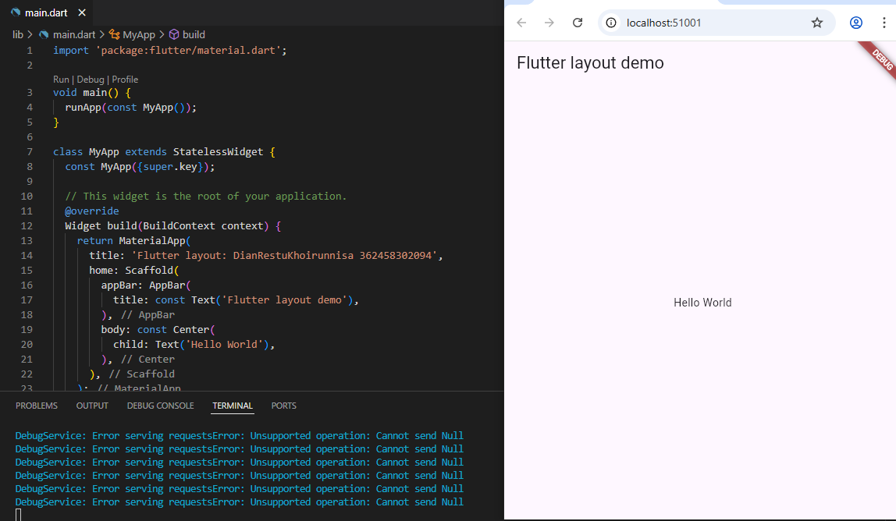

# layout_flutter

Project Layout Flutter

##Praktikum 1
Langkah 1 membuat project baru dengan nama layout_flutter

Langkah 2 mengganti nama dan NIM pada text title yang ada di main

Langkah 4 Implemntasi title now

##Praktikum 2
